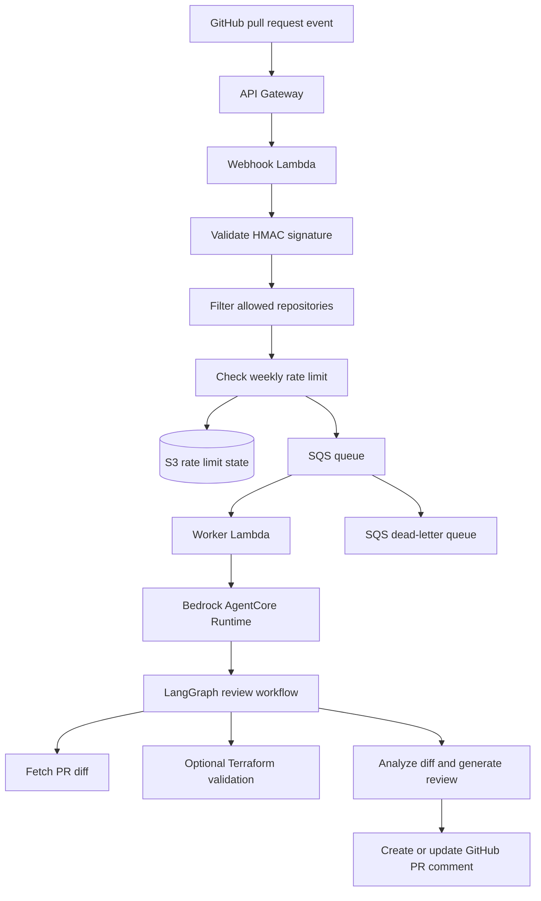

# Bedrock PR Agent

_A serverless automation harness for configurable PR review, infrastructure validation, and AI-assisted engineering workflows on AWS Bedrock._

The current implementation runs as a GitHub App on AWS and uses Anthropic Claude models through Bedrock. It receives pull request events, queues work through SQS, invokes a Bedrock AgentCore/LangGraph review workflow, and updates a single persistent PR comment with concise findings.

The architecture is intentionally modular: prompts, templates, validation tools, and review logic can be swapped per repository, team, or workflow. The same repository is used as the initial deployment target, so changes to the project exercise the deployed review workflow end to end.

## Overview

Bedrock PR Agent is designed as a reusable foundation for workflow-specific engineering automation. The default workflow reviews pull requests by comparing the PR description against the actual diff, optionally incorporating Terraform plan output, and publishing a concise Markdown comment back to the PR.

The project focuses on the operational pieces that matter for real automation:

- verified GitHub webhook handling
- asynchronous event processing through SQS
- Bedrock AgentCore runtime execution for longer-running review work
- repository allowlisting and weekly rate limits
- idempotent PR comments instead of duplicate bot spam
- configurable prompts, templates, and validation logic
- GitHub Actions deployment through AWS CDK

## How it works

On each accepted pull request event, the agent fetches the diff, applies any configured validation tools, asks Bedrock for a concise review, and updates a single persistent PR comment.

At runtime:

1. GitHub sends a `pull_request` webhook to API Gateway.
2. The webhook Lambda validates the HMAC signature, checks the repository allowlist, applies the weekly rate limit, and enqueues accepted events to SQS.
3. The worker Lambda invokes the Bedrock AgentCore runtime.
4. A LangGraph workflow fetches the PR diff, optionally parses Terraform plan logs, and builds a prompt from the configured template.
5. Bedrock generates concise actionable findings.
6. The GitHub client creates or updates a marked PR timeline comment.

The analysis question is intentionally narrow: **does the code diff match what the PR description says it does?** External ticket systems are not required.

Terraform validation is one example of workflow-specific logic plugged into the harness. For repositories listed in `TERRAFORM_VALIDATION_REPOS`, the agent downloads GitHub Actions logs for the PR head SHA, parses Terraform plan output, and flags material infrastructure risk such as deletes or forced replacements.

## Architecture

CDK deploys the system as two stacks:

- `AgentCoreStack` builds the container image, pushes it to ECR, and creates the Bedrock AgentCore runtime.
- `LambdaStack` creates API Gateway, webhook and worker Lambdas, SQS queue and DLQ, S3 rate-limit bucket, and the required IAM wiring.

## Operational design

### Async queueing

GitHub webhooks need a fast response, while model-backed review can take minutes. The webhook Lambda validates and enqueues the request, then returns quickly. The worker Lambda and AgentCore runtime handle the long-running work off the request path.

### Idempotent comments

The bot writes one persistent PR timeline comment marked with a hidden HTML marker. Later runs update that comment instead of appending a new one, which keeps repeated webhook deliveries, retries, and PR updates from creating duplicate review noise.

### Weekly rate limits

Rate limits are stored in S3 as per-repository JSON state and enforced before work is queued. `WEEKLY_REVIEW_LIMIT` defaults to `2`, which keeps model spend predictable and prevents noisy automation from reviewing every event indefinitely.

### Configurable review logic

Prompts live in `prompts/`, comment templates live in `templates/`, and validation steps are implemented as graph nodes/tools. The default implementation includes PR diff review and optional Terraform plan parsing, but the same shape can support other repository, team, or workflow-specific checks.

## Configuration

All configuration is via environment variables. See `.env.example` for the full list.

| Variable | Default | Description |
|----------|---------|-------------|
| `GITHUB_SECRET_NAME` | `github-pr-agent/github` | Secrets Manager secret with `app_id`, `webhook_secret`, and `private_key` |
| `BEDROCK_MODEL_ID` | _required_ | Bedrock model ID or inference profile ARN used by the review agent. The current runtime is configured for Anthropic Claude models through Bedrock. For GitHub Actions deploys, store this as a repository secret. |
| `ALLOWED_REPOS` | _required_ | Comma-separated `owner/repo` allowlist. Empty rejects all repositories; use `*` only when allowing every installed repository is intentional. |
| `TERRAFORM_VALIDATION_REPOS` | _empty_ | Repositories that get Terraform plan analysis |
| `SECURITY_SCAN_ENABLED` | `true` | Enables the zero-cost deterministic changed-line security scan; set to `false`, `0`, `no`, or `off` to skip it |
| `WEEKLY_REVIEW_LIMIT` | `2` | Maximum accepted review events per repository per ISO week |
| `STAGE` | `dev` | Deployment stage used to namespace AWS resource names |

## Deployment

Deployment is designed to run through GitHub Actions after the one-time AWS and GitHub prerequisites are in place.

The setup scripts handle the parts that are easiest to automate safely:

- `scripts/create_github_app.py` starts the GitHub App creation flow and stores app credentials in AWS Secrets Manager.
- `scripts/create_deploy_role.py` creates the GitHub Actions OIDC deploy role and prints the ARN for repository configuration.

Manual setup is still required for Bedrock model access, CDK bootstrap, repository secrets and variables, the final webhook URL, and GitHub App installation approval. See [SETUP.md](SETUP.md) for the full step-by-step runbook.

Once configured, pushes to `main` run the deployment workflow and execute `cdk deploy --all` through GitHub Actions.

## Operations and troubleshooting

Start with GitHub App **Advanced → Recent Deliveries**. It shows the exact webhook payload, response status, and delivery errors, which quickly narrows the issue to GitHub delivery, the webhook Lambda, or downstream processing.

Then check CloudWatch logs in this order:

1. webhook Lambda
2. worker Lambda
3. Bedrock AgentCore runtime

Common issues:

- **No comment posted**
  - Verify the GitHub App webhook is active and points to the deployed `WebhookUrl`.
  - Verify the repository is included in `ALLOWED_REPOS`. An empty allowlist rejects all repositories; set `*` only when reviewing every installed repository is intentional.
  - If logs show `Resource not accessible by integration`, confirm the GitHub App has **Issues: read & write** and that the installation owner approved the updated permissions. Top-level PR timeline comments use GitHub's issue comments API.

- **Duplicate comments**
  - The bot should update an existing marked comment instead of creating new comments. If duplicates appear, check worker timeout/retry behavior, SQS visibility timeout, and whether the existing comment still contains the hidden marker.

- **Rate limit reached**
  - The default limit is `2` accepted review events per repository per week.
  - Rate-limit state is stored in the S3 bucket named `github-pr-agent-{stage}-rate-limits-{account}` with object keys like `owner/repo.json`.
  - Deleting that object resets the counter for the repository.

- **Unexpected model cost**
  - Keep `WEEKLY_REVIEW_LIMIT` conservative.
  - Review diff truncation and prompt size before raising limits.
  - The agent is tuned for concise output with a bounded response token budget.

## Extension points

- **CI failure analysis** — reuse the existing GitHub Actions log download/parsing path to summarize failed jobs and likely root causes.
- **Repository profiles** — select different prompts, templates, validation tools, and severity thresholds per repository.
- **Policy checks** — plug in workflow-specific checks for infrastructure, deployment safety, dependency changes, or security-sensitive paths.
- **Cost controls** — add stronger token/diff budgeting and optional skip rules for low-risk changes.
